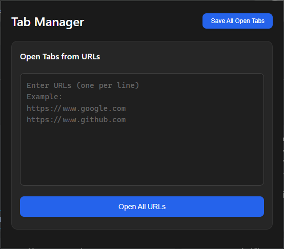

# Tab Manager Extension

An extension to save, view, and restore your open tabs with a beautiful, minimal interface.
Your tab data stays private on your device. Works on Chrome, Firefox, Edge, Opera, and any Chromium-based browser.

---

Popup: Open tabs from URLs, save all open tabs  

Toolbar badge showing the number of open tabs  

Tab Manager page: view, copy, and manage saved URLs  

Settings page (dark mode):  

---

## Features
- Save all open tabs with one click
- View and copy saved URLs in a dedicated manager page
- Open multiple tabs from a list of URLs
- **Batch opening:** Open tabs in customizable batches (e.g., 5 at a time)
- **Configurable delay:** Set the delay (in ms) between opening batches of tabs
- **Choose background or foreground:** Decide if new tabs open in the background or foreground
- **Modern settings page:** All options are easily configurable in a dedicated settings page
- **Dark and light mode:** Toggle between dark and light themes
- **Persistent settings:** All preferences are saved automatically
- Clear saved tabs with confirmation
- Shows the number of open tabs in the browser toolbar
- Modern, minimal, dark-themed UI (with light mode option)
- No tracking, no remote code, secure by design

---

## Usage

### Popup
- **Open Tabs from URLs:** Paste or type URLs (one per line) and click "Open All URLs". The extension will open them according to your batch and delay settings.
- **Settings:** Click the ⚙️ icon to open the settings page, where you can:
  - Set the delay between batches (in ms)
  - Set the batch size (number of tabs per batch)
  - Choose if tabs open in background or foreground
  - Toggle dark/light mode
- **Save All Open Tabs:** Click to save all currently open tabs for later viewing or copying.

### Saved Tabs Page
- View, copy, and manage your saved URLs
- Refresh to save the current open tabs again
- Clear all saved tabs (button only enabled if there are tabs to clear)

---

## Example Settings
- **Delay between tabs:** 150ms (default, can be changed)
- **Batch size:** 5 (default, can be changed)
- **Open tabs in background:** On by default (can be changed)
- **Theme:** Dark or light (toggle in settings)

---

## Releases

There are **two releases** of this extension, ready to use:

- **TabManager**: For Chrome, Edge, Brave, Opera (Chromium browsers)
- **TabManager-FireFox**: For Firefox

**You do not need to rename or modify any files.**
Just download the release for your browser and follow the instructions below.

---

## Installation (Development Mode)

### Chrome, Edge, Brave, Opera
1. Download and extract the **TabManager** release.
2. Open `chrome://extensions` (or equivalent in your browser)
3. Enable **Developer mode**
4. Click **Load unpacked**
5. Select the extracted folder (with `manifest.json`)

### Firefox
1. Download and extract the **TabManager-FireFox** release.
2. Open `about:debugging#/runtime/this-firefox`
3. Click **Load Temporary Add-on**
4. Select the extracted folder (with `manifest.json`)

---

## Browser Compatibility
- **Google Chrome, Microsoft Edge, Brave, Opera, or any Chromium-based browser:** Fully supported — use the TabManager release.
- **Mozilla Firefox:** Fully supported — use the TabManager-FireFox release.

---

## Security & Privacy
- No remote code, no analytics, no tracking
- Only stores tab URLs/titles locally
- No content scripts or host permissions
- Strong Content Security Policy

## License
This project is licensed under the GNU General Public License v3.0 (GPL-3.0). See the LICENSE file for details. 